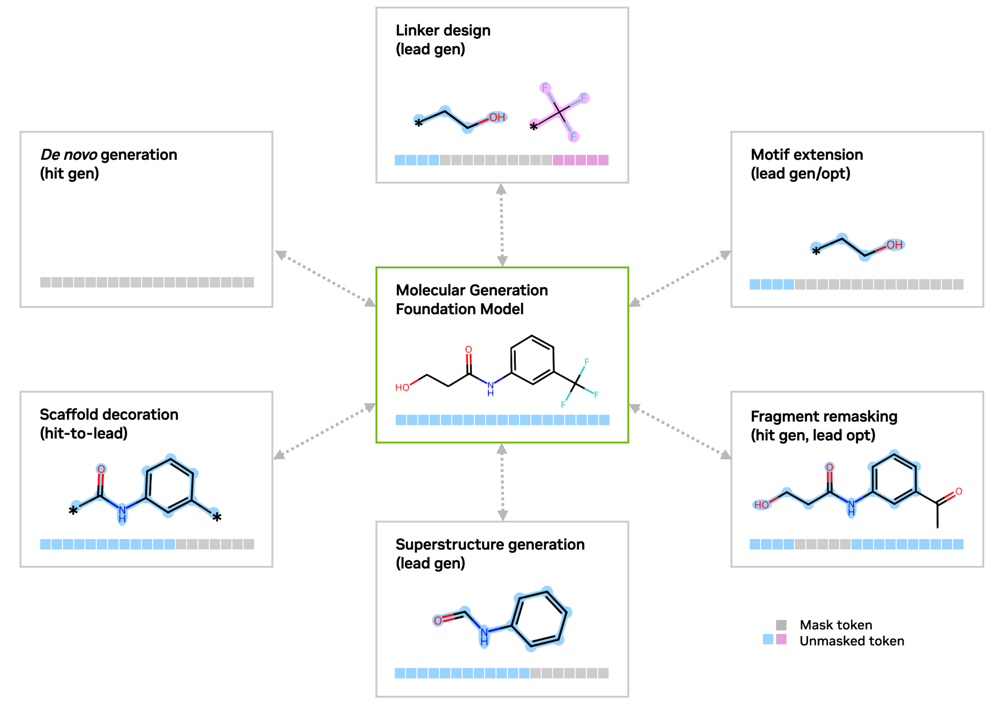

# NVIDIA GenMol

## Molecule Generation with the GenMol NIM
GenMol is a masked diffusion model trained on molecular Sequential Attachment based Fragment Embeddings, or [SAFE representations](https://arxiv.org/abs/2310.10773) for fragment-based molecule generation.  GenMol a generalist model for various drug discovery tasks, including de novo generation, linker design, motif extension, scaffold decoration/morphing, hit generation, and lead optimization.  The use of the SAFE format allows for flexibility in the generation schema, such as:

 1. Specifying fixed fragment(s), which will remain unchanged in generation
 2. Specifying specific positions that generated fragments will attach to
 3. Generating a partial or full fragment or generating multiple fragments
 4. Generating fragments at any range of lengths specified.


The example notebooks in this repository demonstrate how to deploy and build these workflows with the NVIDIA GenMol NIM for fragment-based molecule generation:
 1. [GenMol Basics](1.basics.ipynb)
 2. [Linker Design](2.linder-design.ipynb)
 3. [Hit Generation](2.hit-generation.ipynb)

To run these examples locally, see the [Setup](#Setup) section below.

***



NVIDIA BioNeMo NIMS can be integrated into existing workflows to leverage cutting edge Gen-AI capabilities for drug discovery, from ligand generation to protein folding to docking. For more details, please visit the [NVIDIA BioNeMo NIMs homepage](https://build.nvidia.com/explore/biology).  These capabilities are also integrated into reference workflows in NVIDIA NIM Agent Blueprints. For more details, please visit [NVIDIA NIM Blueprints](https://build.nvidia.com/nim/blueprints).

## Setup

### Preparing the GenMol NIM
Please visit the [NVIDIA GenMol NIM page](https://build.nvidia.com/nvidia/genmol) for additional details and the [GenMol NIM Documentation](https://docs.nvidia.com/nim/bionemo/genmol/latest/overview.html) to get started.

These basic steps should be run on the system hosting the GenMol NIM.

1. Set your NGC API Key: `export NGC_API_KEY=<PASTE_API_KEY_HERE>`
2. Run `docker login --username '$oauthtoken' --password $NGC_API_KEY`
3. Run the container:
   ```bash
      export LOCAL_NIM_CACHE=~/.cache/nim
      docker run --rm --name genmol --runtime=nvidia \
        -e NGC_API_KEY \
        -v $LOCAL_NIM_CACHE:/opt/nim/.cache \
        --shm-size=2G \
        --ulimit memlock=-1 \
        --ulimit stack=67108864 \
        -p 8000:8000 \
        nvcr.io/nim/nvidia/genmol:1.0.0
    ```

> **NOTE:**  For convenience, define your `LOCAL_NIM_CACHE` to store the models and databases used by the GenMol NIM.  Using the `LOCAL_NIM_CACHE` will avoid having to re-download these files on subsequent runs.

You can verify that the NIM has started successfully by querying its status.  The following command will return `{"status":"ready"}` when the NIM is ready:
```bash
   curl -X 'GET' \
     'http://localhost:8000/v1/health/ready' \
     -H 'accept: application/json'
```

### Jupyter Lab Environment

```bash
    # If the python3 venv package is not installed, install using your OS package manager.  For example, for apt-based distros:
    apt install python3-venv

    # Then create a venv and install the Jupyter Lab environment
    python3 -m venv venv
    source venv/bin/activate
    pip install jupyterlab ipywidgets
```

### GenMol Notebook Dependencies and Launching the Lab Environment

Once the GenMol NIM and Jupyter Lab environment have been configured as above, clone this repository and launch the notebooks with:
```bash
    source venv/bin/activate
    pip install -r requirements.txt
    jupyter-lab
```

