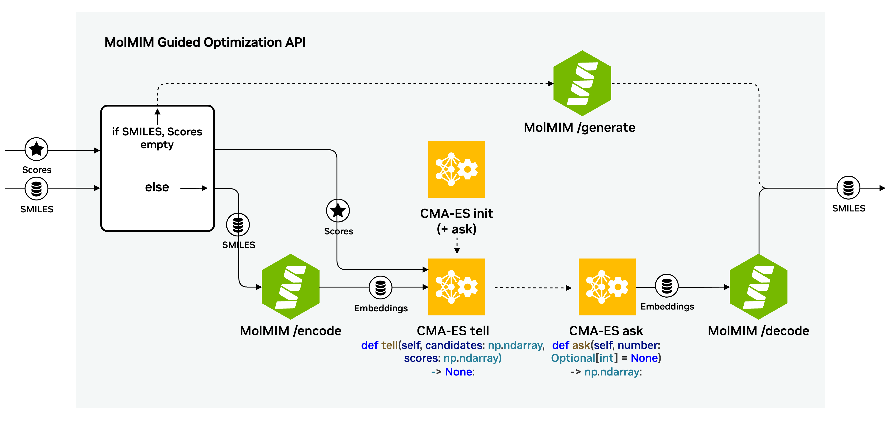

# MolMIM Guided Optimization API

This package provides a FastAPI API interface to run MolMIM Guided Optimization.

The Guided Optimization API provides an interface to a single step of the optimization process by taking a list of SMILES and scores as input, computing an updated embedding representation based on the input scores, and decoding an optimized set of molecules based on the updated embeddings.  If no SMILES or scores are provided as input, the Optimization API will generate a starting set of SMILES using the MolMIM `/generate` endpoint.

The API accepts as input:
 - n: The number of desired molecules (`Int`)
 - smiles: List of SMILES (`List[str]`)
 - scores: List of scores for the input SMILES (`List[str]`)
 - sigma: CMA-ES sampling std dev (`Float, range[0. ,2]`)

and returns:
 - smiles: List of optimized SMILES (`List[str]`)



## Setup - Guided Optimization API

The Optimization API provides a FastAPI endpoint and the MolMIM NIM microservice using Docker compose.

### Prerequisites
* [Docker](https://docs.docker.com/engine/install/)
* [Docker Compose](https://docs.docker.com/compose/)
* [NVIDIA Container Toolkit](https://docs.nvidia.com/datacenter/cloud-native/container-toolkit/latest/install-guide.html)


To pull the MolMIM NIM container used in the docker compose configuration, you will need to login to `nvcr.io` with your [NGC API Key](https://ngc.nvidia.com).

```bash
$ docker login nvcr.io
Username: $oauthtoken
Password: <PASTE_API_KEY_HERE>
```

The MolMIM NIM container also requires the `NGC_API_KEY` environment variable.
```bash
   export NGC_API_KEY=<PASTE_API_KEY_HERE>
```

Then, launch the API using docker compose.
```bash
docker compose up
```

Once the services have started, you can access API documentation in your browser (assuming running locally) at [localhost:8080/docs](http://localhost:8080/docs).

The MolMIM NIM container is also available at [localhost:8000/docs](http://localhost:8000/docs).

## Setup - Notebook

An interactive example is included in [molmim-opt-api-runner.ipynb](molmim-opt-api-runner.ipynb).  To run this notebook locally, set up a python virtual environment and install dependencies:

```bash
   python3 -m venv venv
   source venv/bin/activate
   pip install -r requirements.txt
```

Then launch a Jupyter Lab session from this top level directory and execute the [molmim-opt-api-runner.ipynb](molmim-opt-api-runner.ipynb) notebook in the Jupyter Lab session.

```bash
   jupyter-lab
```


## Additional Information

Please refer to the [NVIDIA MolMIM NIM docs](https://docs.nvidia.com/nim/bionemo/molmim/latest/index.html) and [QuickStart guide](https://docs.nvidia.com/nim/bionemo/molmim/latest/quickstart-guide.html) for more information on the MolMIM NIM. There are also [additional notebooks](https://docs.nvidia.com/nim/bionemo/molmim/latest/endpoints.html#notebooks) showcasing for example how to use MolMIM embeddings to cluster molecules and how to interpolate between molecules by manipulating MolMIM hidden states.

# License

Please see [LICENSE.txt](LICENSE.txt).
